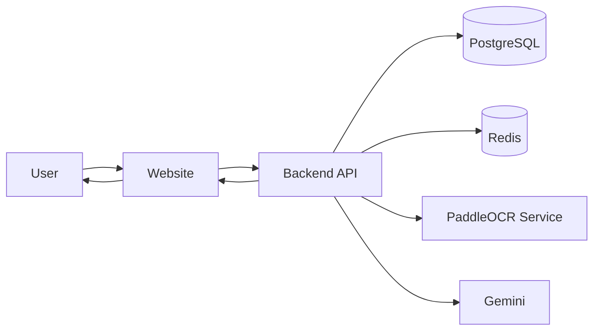

# College Project

A full-stack document digitization system that converts paper tables from photos into structured PostgreSQL data. It uses a Python microservice with PaddleOCR and Gemini-based OCR flows to process scanned images. Scanned data can be reviewed before saving, imported into department tables with duplicate detection, edited through the dashboard, exported in formats like CSV, JSON, and XLSX and tracked through an audit log system with an admin-only logs page.

## Apps

- `apps/website` - frontend built with React, Vite, and TanStack
- `apps/backend` - backend built with Bun, Hono, Drizzle, and Better Auth
- `apps/fast-api` - python microservice that runs PaddleOCR for table scanning

## Tech Stack

- `React`
- `Vite`
- `Bun`
- `Hono`
- `FastAPI`
- `PaddleOCR`
- `Drizzle ORM`
- `PostgreSQL`
- `Zod`
- `pnpm` workspaces

## Architecture



- `Website` - React dashboard for scanning, reviewing, editing, exporting, and managing access.
- `Backend API` - Bun/Hono service for auth, roles, imports, dynamic tables, and audit logs.
- `PostgreSQL` - stores users, departments, generated tables, row data, and logs.
- `Redis` - stores rate-limit state.
- `PaddleOCR Service` - FastAPI microservice for image-based table recognition.
- `Gemini` - AI OCR path for table extraction and imports.

## Features

- Role-based access with `system_admin`, `department_admin`, and `department_staff`
- Department and staff management
- OCR table scanning from images using `PaddleOCR` and `Gemini`
- OCR review step before creating a table or importing rows
- Dynamic PostgreSQL table creation from scanned schemas
- Row import into existing tables from image and CSV files
- Duplicate row detection during import
- Inline row editing, creation, deletion, search, and pagination
- Export to `CSV`, `JSON`, and `XLSX`
- Audit logging for table creation and row-level changes
- Admin-only logs page for reviewing system activity
- Role-based dashboard theme colors

## How It Works

- A `system_admin` creates department admins
- A `department_admin` creates staff and manages department tables
- Users scan paper tables from images using `PaddleOCR` or `Gemini`
- Scanned rows are reviewed and corrected before saving
- New tables can be created from scanned schemas and data
- Existing tables can import rows from images or CSV files
- Duplicate rows are detected and skipped during import
- All important actions are stored in audit logs

## Getting Started

### Requirements

- `node 22+`
- `pnpm`
- `bun`
- `docker`
- `uv`
- `python 3.12`

### Install

```bash
pnpm install
```

Install Python dependencies for the OCR microservice:

```bash
cd apps/fast-api
uv sync
```

### Run the project

```bash
pnpm dev
```

This starts the workspace in development mode and brings up the Docker services used by the project.

## Useful Scripts

```bash
pnpm dev
pnpm lint
pnpm format
pnpm update
```

## Project Structure

```text
├── apps
│   ├── backend
│   ├── fast-api
│   └── website
├── package.json
└── README.md
```

## Team

Aman Chand

Raksha Karn

Aayusha Dhakal
